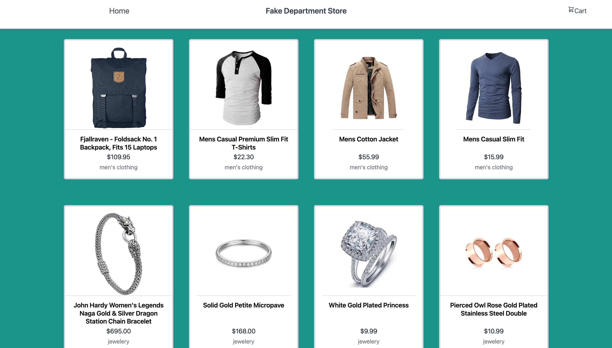

# Fake Department Store App

A Stock Historical Financial Data application to illustrate using React and Redux to pull data from Fake Store API and display stock
information in a chart:

1. Display available products.
2. Display selected product.
3. Add to Shopping Cart (coming soon).

### Exploring frontend features:

1. React
2. Redux and ReduxToolkit
3. ReduxDev Tools
4. Tailwind CSS
5. Flowbite and TailwindComponent

---



### Backend Framework:

- None

### Frontend Framework:

- **React v18.2.0:** https://react.dev/
- Node v21.6.0
- Npm v10.3.0

### Tailwind features:
#### Flowbite
- https://flowbite.com/
- Flowbite - Tailwind CSS Components, an open-source library of over 600+ UI components, sections, and pages built with the utility classes from Tailwind CSS and designed in Figma.

#### TailwindComponents
- https://tailwindcomponents.com/
- Open source Tailwind UI components and templates to bootstrap your new apps, projects or landing sites.

#### Heroicons
- https://heroicons.com/
- Using Heroicons - hand-crafted icons by makers of Tailwind.


### React features:
#### ReduxDev Tools
- https://github.com/reduxjs/redux-devtools 
- ReduxDev Tools - Developer Tools to power-up Redux development workflow or any other architecture which handles the state change. Browser extensions for Chrome, Edge, and Firefox.

#### React Markdown
- https://github.com/remarkjs/react-markdown
- React-markdown allows you to parse Markdown content and convert it into React components, which can then be rendered within your React application. It provides a simple and convenient way to integrate Markdown content seamlessly into your UI.

### Additional Features:
#### Fake Store API
- https://www.alphavantage.co/documentation/
- REST API for your e-commerce or shopping website prototype.

## Local Dev Installation

Clone the repo locally:

```sh
git clone https://github.com/wayjay4/fake_store_app.git fakestore_app
```

Go into fakestore_app dir:

```sh
cd fakestore_app
```

Install NPM dependencies (node v20.11.0, npm v10.3.0):

**Node**

```sh
nvm install 21.6.0
```

```sh
nvm use 21.6.0
```

- https://stackoverflow.com/questions/7718313/how-to-change-to-an-older-version-of-node-js

**Npm**

```sh
npm install npm@10.3.0 -g
```

- https://stackoverflow.com/questions/9755841/how-can-i-change-the-version-of-npm-using-nvm

Setup configuration:

```sh
cp .env.example .env
```

Add Fake Store API url and api key to .env file:

```sh
REACT_APP_FSA_BASE_URL=https://fakestoreapi.com
#REACT_APP_FSA_API_KEY=no_key_is_required_for_site
```

Build assets:

```sh
npm install
```

```sh
npm run build
```
---

### Serve application in local development

```sh
npm run start
```

You're ready to go! Visit App in your browser!:

http://localhost:3000/

---

### Configure Fake Store API connection

Follow Fake Store API documentation at https://fakestoreapi.com/docs to:

- get user and product data

Setup app configuration:

- Open .env and add api key.

```sh
REACT_APP_FSA_BASE_URL=https://www.alphavantage.co/query
#REACT_APP_FSA_API_KEY=no_key_is_required_for_site
````
---

## Installed NPM packages:

### React Frontend
````
npx create-react-app fakestore_app
````

### Axios
````
npm install axios
````

### React Redux
````
npm install redux react-redux
npm install @reduxjs/toolkit
npm install react-router-dom
````

### React Markdown
````
npm install react-markdown
````

---

# Getting Started with Create React App

This project was bootstrapped with [Create React App](https://github.com/facebook/create-react-app).

## Available Scripts

In the project directory, you can run:

### `npm start`

Runs the app in the development mode.\
Open [http://localhost:3000](http://localhost:3000) to view it in your browser.

The page will reload when you make changes.\
You may also see any lint errors in the console.

### `npm test`

Launches the test runner in the interactive watch mode.\
See the section about [running tests](https://facebook.github.io/create-react-app/docs/running-tests) for more information.

### `npm run build`

Builds the app for production to the `build` folder.\
It correctly bundles React in production mode and optimizes the build for the best performance.

The build is minified and the filenames include the hashes.\
Your app is ready to be deployed!

See the section about [deployment](https://facebook.github.io/create-react-app/docs/deployment) for more information.

### `npm run eject`

**Note: this is a one-way operation. Once you `eject`, you can't go back!**

If you aren't satisfied with the build tool and configuration choices, you can `eject` at any time. This command will remove the single build dependency from your project.

Instead, it will copy all the configuration files and the transitive dependencies (webpack, Babel, ESLint, etc) right into your project so you have full control over them. All of the commands except `eject` will still work, but they will point to the copied scripts so you can tweak them. At this point you're on your own.

You don't have to ever use `eject`. The curated feature set is suitable for small and middle deployments, and you shouldn't feel obligated to use this feature. However we understand that this tool wouldn't be useful if you couldn't customize it when you are ready for it.


NOTES:
-installation: npx create-react-app fakestoreapp
-install axios: npm install axios
-install: npm install react-router-dom
-install: npm install redux react-redux
-install: npm install @reduxjs/toolkit
-install: npm install react-markdown

-add semantic-ui css to index.html head see website: https://cdnjs.com/libraries/semantic-ui
-add redux-devtools to browser: https://github.com/reduxjs/redux-devtools
-add fakeproductapi: https://fakestoreapi.com
-used tailwind template at: https://tailwindcomponents.com/component/e-commerce-product-page
